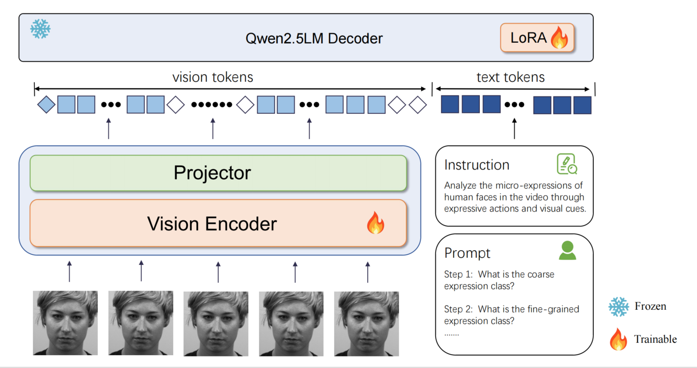
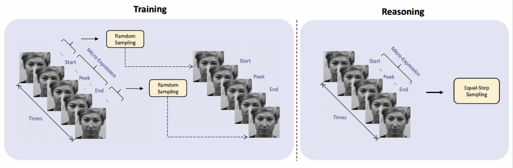
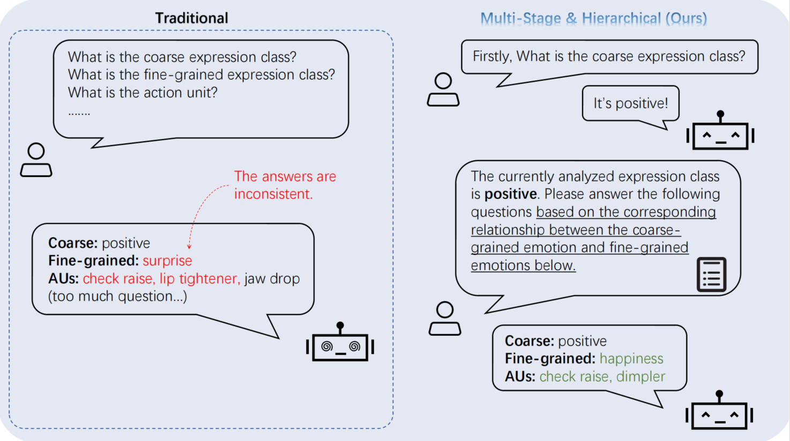
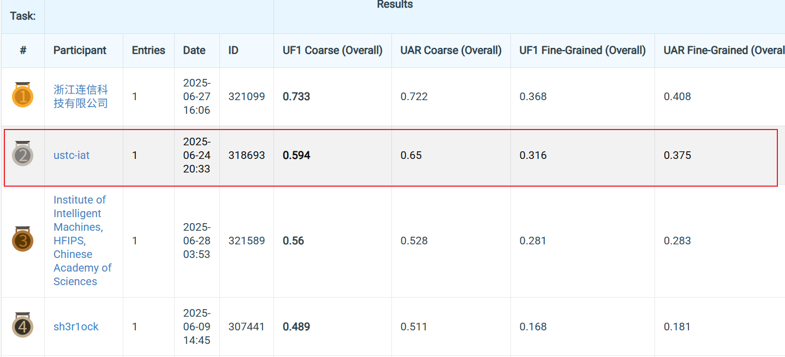

# HierMEQA: A Relationship-Aware Hierarchical Framework for Consistent Micro-Expression Visual Question Answering (ACM MM MEGC2025)


##   :jack_o_lantern: Abstract
The rise of Multimodal Large Language Models (MLLMs) offers new opportunities for Micro-Expression (ME) analysis. This paper introduces Micro-Expression Visual Question Answering (ME-VQA), a novel task reformulating ME annotations (e.g., emotion categories, action units) into QA pairs. To address key challenges—hardware limitations, context inconsistency, and compositional reasoning gaps—we propose a Relationship-Aware Hierarchical VQA Framework. Our approach leverages mined emotion correlations (e.g., coarse-to-fine label dependencies) and employs a two-stage process: 1) Coarse-grained anchoring for broad emotion categories, and 2) Fine-grained reasoning constrained by coarse outputs and statistical rules. We further optimize efficiency via a dual-phase video sampling strategy: during training, keyframes (onset/apex/offset) and random non-expression frames are used; uniform sampling is applied at inference. Experiments demonstrate significant improvements in answer consistency and accuracy.


## 🚀 Main Method

<div align="center">
  <br>
  <em>Fig 1：Overview of our Method</em>
</div>


<div align="center">
  <br>
  <em>Fig 2：Our sampling strategy</em>
</div>


<div align="center">
  <br>
  <em>Fig 3：A example of our method</em>
</div>


## :crescent_moon: MEGC 2025 Track STR Leaderboard

<div align="center">
  <br>
  <em>Fig 4：Leaderboard</em>
</div>


## ⤴️ Training

```bash
bash train_lora.sh
```
## :arrow_upper_right: Reasoning

```bash
bash merge.sh
bash infer.sh
```

You need to modify the corresponding path in the script.

